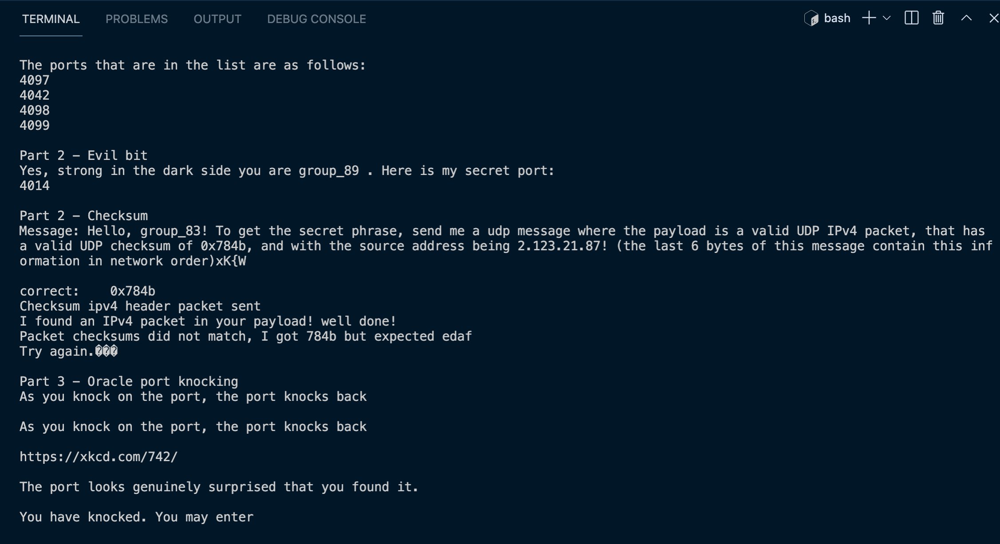

# Project 2 TSAM

To run this massive project you have to find your local ip first. In order to find your local ip you must use this command in the terminal
```
    ifconfig
```

You will be prompted with your computer's interfaces. Scroll to interface en0 and there you will find your local ip address under the label inet. 

# How to run the program
Change your current working directory to project2 and run the program using this command.
```
    make && sudo ./puzzlesolver <src_port> <your_local_ip_address>
```

# The results
In the end we finished the evil bit port and got the secret port but we did not finish the checksum port.
We also modified our port scanner so it worked with htons(recvaddr.sin_port) where the recvaddr is the receive address of type socket_in.
We got this message from the checksum port "I found an IPv4 packet in your payload! well done!
Packet checksums did not match, I got 1372 but expected c88d
Try again.\��".

# Expected output
Here below is a screenshot of the expected output.

